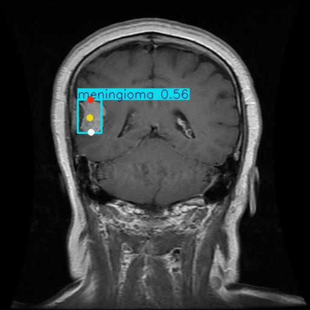
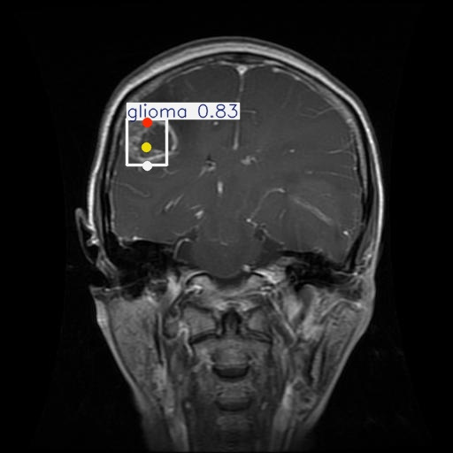

# Brain-Tumor-Detection-YOLOv8-Pose
Detection of Brain Tumor in MRI Images using YOLOv8-Pose

## 🖼️ Detection Results Gallery
| Meningioma | Glioma | No Tumor (Background) |
| :---: | :---: | :---: |
|  |  |  |

##  Key Features
- **Accurate Localization:** It uses three keypoints instead of a bounding box.
- **Multi-class:** Detects Meningioma, Glioma, and no-tumors.
- **Robustness:** Optimized with a 0.20 confidence threshold for dealing with scans of low brightness.

## 📁 Project Structure
- `scripts/`: Python code for training and testing.
- `weights/`: Trained model (best.pt).
- `results/`: Sample detected images.
